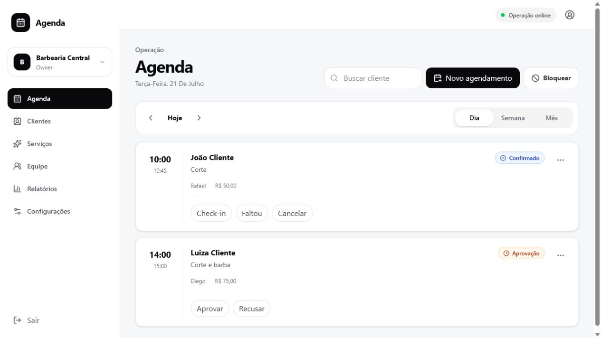
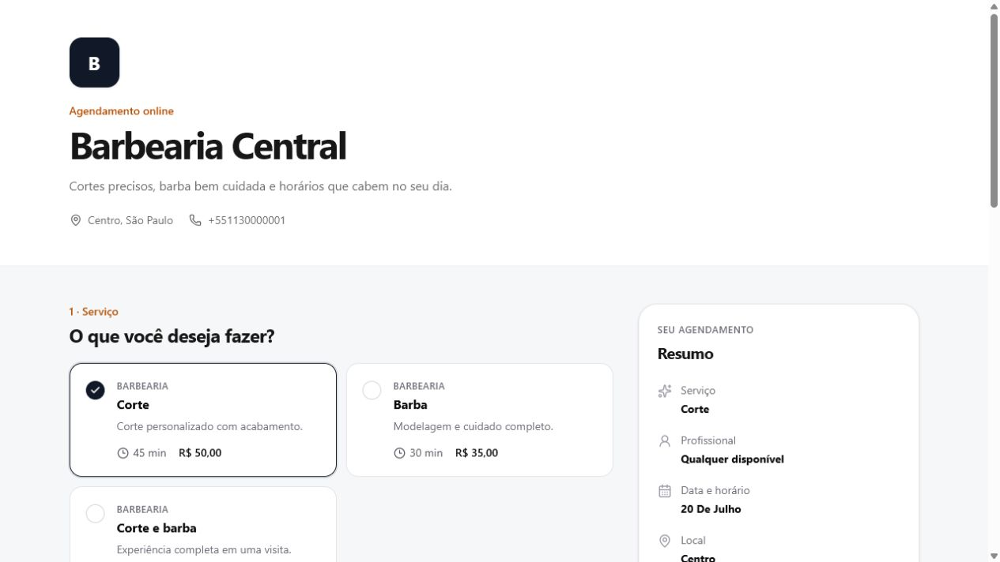
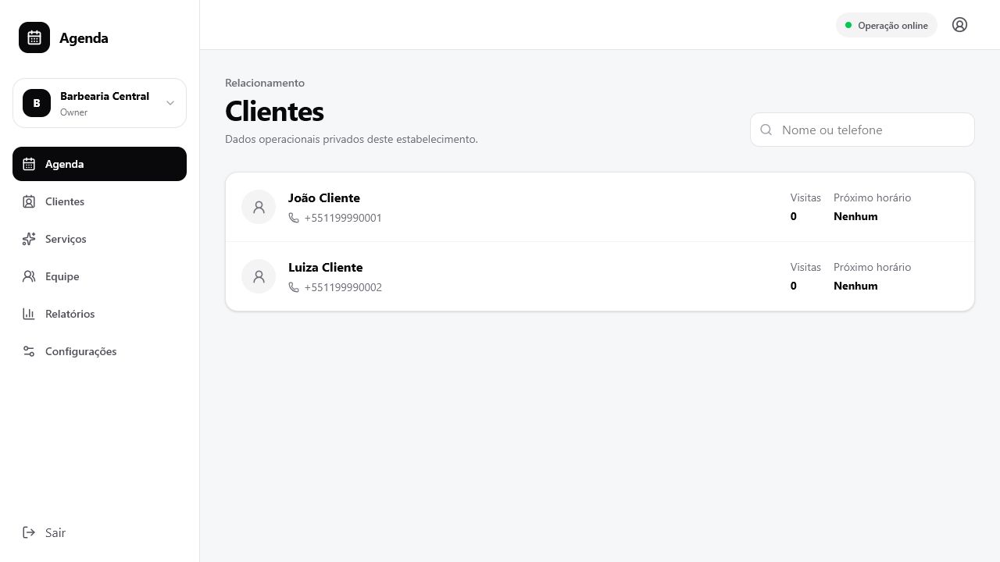
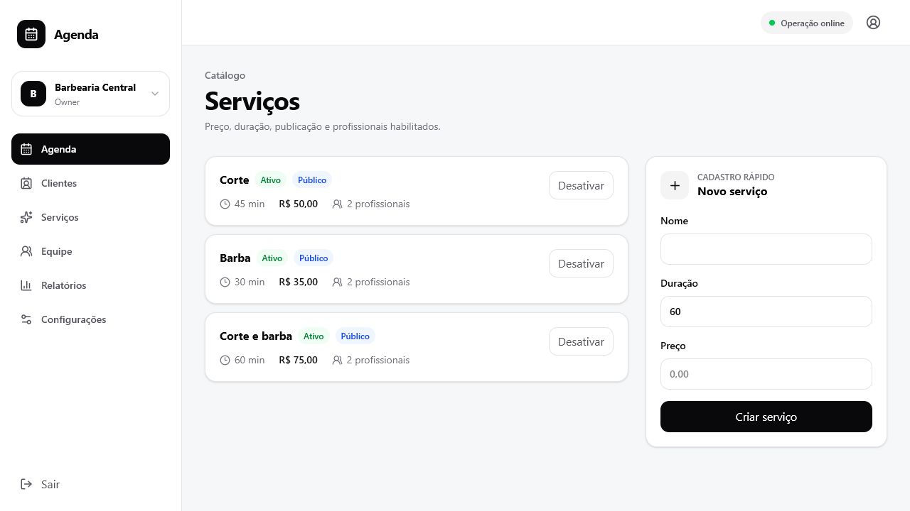
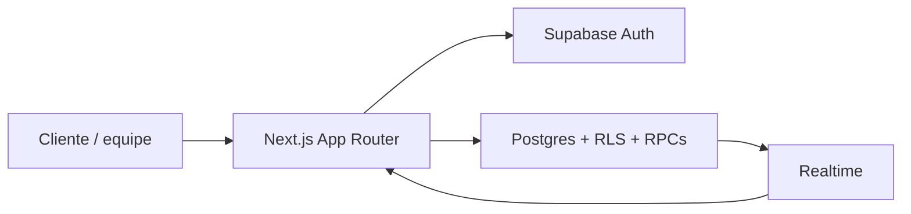

# Agenda

SaaS multiestabelecimento para organizar serviços, equipe, clientes, agenda e
reservas públicas. Construído com Next.js, TypeScript e Supabase.



## O que está pronto

- Autenticação SSR, recuperação de senha e isolamento por tenant.
- Agenda administrativa com visualização diária, semanal e mensal.
- Agendamento administrativo, bloqueios e alteração de status.
- Catálogo de serviços e profissionais.
- Clientes separados por estabelecimento.
- Página pública de reservas responsiva.
- Disponibilidade e reserva transacional no Postgres.
- Cancelamento e reagendamento por token seguro.
- Relatórios operacionais dos últimos 30 dias.
- Publicação condicionada a checklist e contraste WCAG AA.
- RLS forçada, rate limit persistente e prevenção de sobreposição com GiST.

## Experiência do cliente



O cliente escolhe serviço, profissional opcional, data e horário sem criar uma
conta. A confirmação recalcula a disponibilidade dentro da transação.

## Operação

| Clientes | Serviços |
|---|---|
|  |  |

## Arquitetura



- Server Components por padrão.
- Sessão Supabase em cookies SSR.
- Autorização próxima ao dado e RLS como última barreira.
- Datas em UTC com timezone IANA por estabelecimento.
- Dinheiro em centavos e telefones em E.164.
- Reservas e bloqueios protegidos por intervalos `tstzrange` e GiST.
- Schema ativo reduzido a 30 tabelas objetivas.

## Documentação

| Documento | Público |
|---|---|
| [Documentação técnica](docs/TECHNICAL.md) | Engenharia e operação |
| [Arquitetura detalhada](docs/ARCHITECTURE.md) | Engenharia |
| [Banco de dados](docs/DATABASE.md) | Engenharia e dados |
| [Instruções para agentes](AGENTS.md) | Agentes de IA e contribuidores |
| [Guia do proprietário](docs/OWNER_GUIDE.md) | Donos e administradores |
| [Manual em PDF](output/pdf/manual-do-proprietario-agenda.pdf) | Donos e administradores |
| [Status de implementação](docs/IMPLEMENTATION_STATUS.md) | Produto e QA |

## Stack

- Next.js 16 e React 19.
- TypeScript strict.
- Supabase Auth, Postgres, Storage e Realtime.
- Tailwind CSS 4.
- Zod, Vitest, Playwright e pgTAP.

## Executar localmente

Requisitos: Node.js 22.14+, npm 10+ e Docker Desktop.

```bash
npm install
npx supabase start
npx supabase db reset
Copy-Item .env.example .env.local
npm run dev
```

Configure `.env.local`:

```dotenv
NEXT_PUBLIC_SUPABASE_URL=http://127.0.0.1:54321
NEXT_PUBLIC_SUPABASE_PUBLISHABLE_KEY=<publishable-key>
NEXT_PUBLIC_APP_URL=http://localhost:3000
SUPABASE_SERVICE_ROLE_KEY=<somente-servidor>
BOOKING_TOKEN_PEPPER=<32-ou-mais-caracteres>
```

Nunca exponha `sb_secret`, `service_role` ou peppers em variáveis `NEXT_PUBLIC_*`.

## Dados demonstrativos

Após o seed local, a senha comum é `AgendaLocal123!`.

| Conta | Acesso |
|---|---|
| `dono.barbearia@agenda.local` | Owner da Barbearia Central |
| `dona.salao@agenda.local` | Owner do Salão da Ana |
| `dona.clinica@agenda.local` | Owner da Clínica Vida |
| `multi@agenda.local` | Recepção da barbearia e admin do salão |

Essas credenciais são exclusivamente demonstrativas.

## Comandos

```bash
npm run dev
npm run lint
npm run typecheck
npm run test
npm run build
npm run validate
npm run test:integration
npm run test:e2e
npm run test:db
```

## Segurança

- Slug identifica; nunca autoriza.
- Toda entidade de negócio é limitada por tenant.
- Chaves secretas ficam somente no servidor.
- A confirmação de reserva recalcula disponibilidade.
- Constraints são a autoridade final contra concorrência.
- Dados administrativos usam cache privado ou `no-store`.

Antes da produção, configure SMTP, redirect URLs, MFA para papéis críticos,
CAPTCHA, backups/PITR, alertas, domínio e secrets no provedor de hospedagem.

## Licença

Projeto privado. Defina uma licença antes de distribuição pública.
