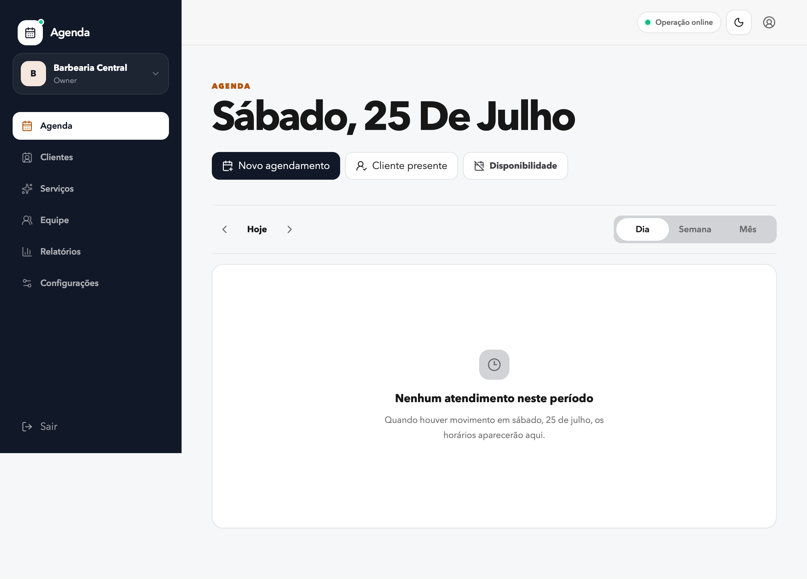
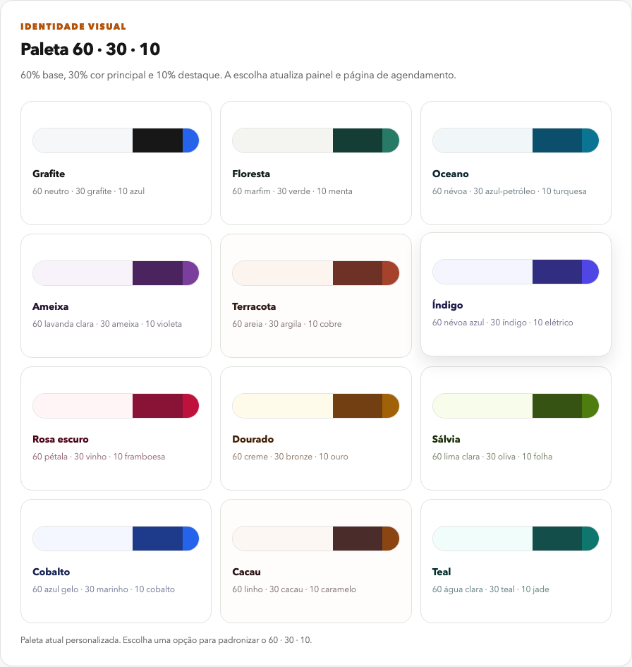
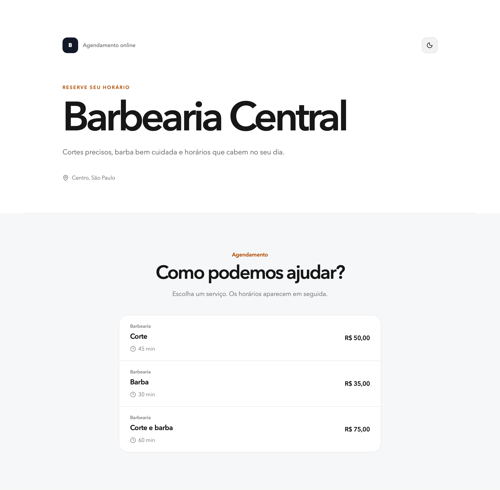
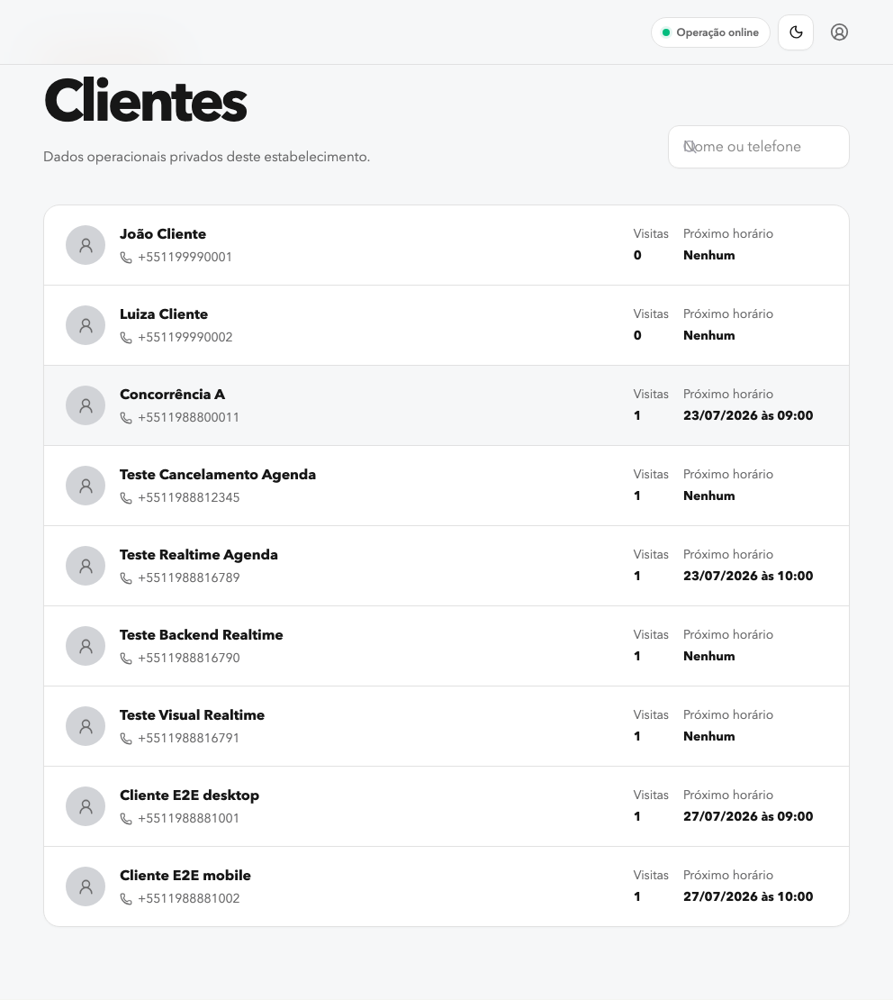
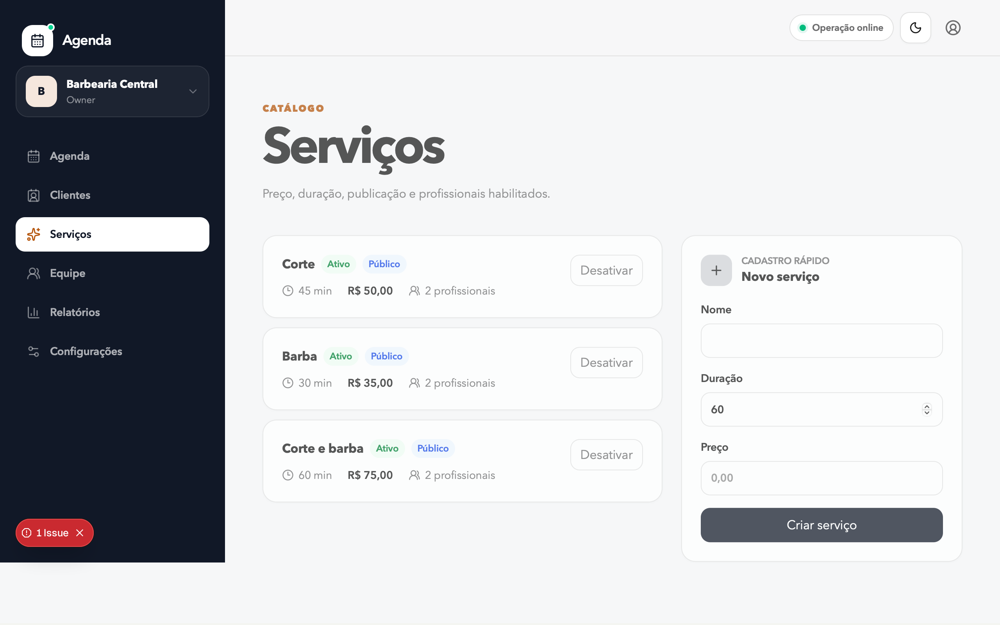
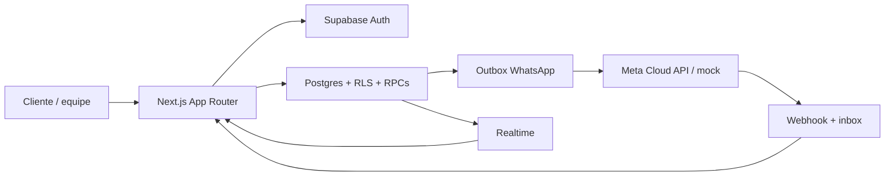

# Agenda

SaaS multiestabelecimento para organizar serviços, equipe, clientes, agenda e
reservas públicas. Construído com Next.js, TypeScript e Supabase.



## O que está pronto

- Autenticação SSR, recuperação de senha e isolamento por tenant.
- Agenda administrativa com visualização diária, semanal e mensal.
- Agendamento administrativo, bloqueios e alteração de status.
- Catálogo de serviços e profissionais.
- Clientes separados por estabelecimento.
- Página pública de reservas responsiva.
- Disponibilidade e reserva transacional no Postgres.
- Cancelamento e reagendamento por token seguro.
- Relatórios operacionais dos últimos 30 dias.
- Publicação condicionada a checklist e contraste WCAG AA.
- Paletas 60-30-10 pré-definidas por estabelecimento, refletidas no painel e na reserva pública.
- Tema claro/escuro por dispositivo, preservando a identidade de cada estabelecimento.
- RLS forçada, rate limit persistente e prevenção de sobreposição com GiST.
- Canal WhatsApp oficial com inbox, outbox, roteamento multi-tenant, conversa
  persistida, links/QR por tenant, retenção, provedor mock e simulador interno.
- Dois modos de atendimento por estabelecimento, escolhidos no onboarding e
  editáveis em Configurações › WhatsApp: **botões** (o cliente toca nas opções) ou
  **texto** (sem botões; o bot entende frases como "quero agendar corte sexta às 14h
  com a Maria" por regras determinísticas, sem LLM, e pergunta só o que faltar).

## WhatsApp Business Platform

O WhatsApp é outro canal para o mesmo núcleo transacional de disponibilidade,
criação, cancelamento e reagendamento. O ambiente local usa somente o provedor
mock: não abre sessão de WhatsApp Web e não envia mensagens reais. O número central
é roteado por código do estabelecimento, sessão ou histórico; a modelagem também
aceita números exclusivos, próprios e múltiplos números por tenant.

O canal é validado de ponta a ponta na CI: as migrations aplicam do zero, o seed
carrega, 173 asserções pgTAP cobrem RLS, workers e concorrência, e 51 cenários
Playwright percorrem o simulador, incluindo reserva real, evento duplicado, disputa de
horário com o site e atendimento humano.

O tráfego Meta permanece desativado até existirem aplicativo, WABA, número
registrado, webhook HTTPS, templates aprovados e segredos no cofre. Consulte a
[decisão arquitetural](docs/adr/0001-whatsapp-cloud-api-channel.md), o
[checklist de ativação](docs/whatsapp-meta-activation.md) e a
[auditoria do canal](docs/whatsapp-validation-report.md), que lista item a item o que
está coberto e o que segue pendente.

## Identidade visual por estabelecimento



Owners e admins escolhem entre 12 paletas acessíveis em **Configurações**. Cada
paleta aplica 60% de base, 30% de cor principal e 10% de destaque no painel
administrativo e na página pública de agendamento. A prévia funciona também no
Safari, sem depender de recursos CSS recentes.

## Experiência do cliente



O cliente escolhe serviço, profissional opcional, data e horário sem criar uma
conta. A confirmação recalcula a disponibilidade dentro da transação.

## Operação

| Clientes | Serviços |
|---|---|
|  |  |

## Arquitetura


```mermaid
flowchart LR
  Browser["Cliente / equipe"] --> Next["Next.js App Router"]
  WhatsApp["Meta Cloud API / mock"] --> Inbox["Webhook + inbox"]
  Inbox --> Next
  Next --> Auth["Supabase Auth"]
  Next --> DB["Postgres + RLS + RPCs"]
  DB --> Outbox["Outbox WhatsApp"]
  Outbox --> WhatsApp
  DB --> Realtime["Realtime"]
  Realtime --> Next
```

- Server Components por padrão.
- Sessão Supabase em cookies SSR.
- Autorização próxima ao dado e RLS como última barreira.
- Datas em UTC com timezone IANA por estabelecimento.
- Dinheiro em centavos e telefones em E.164.
- Reservas e bloqueios protegidos por intervalos `tstzrange` e GiST.
- Schema ativo limitado a fluxos que existem na interface ou API.

## Documentação

| Documento | Público |
|---|---|
| [Documentação técnica](docs/TECHNICAL.md) | Engenharia e operação |
| [Arquitetura detalhada](docs/ARCHITECTURE.md) | Engenharia |
| [Banco de dados](docs/DATABASE.md) | Engenharia e dados |
| [Instruções para agentes](AGENTS.md) | Agentes de IA e contribuidores |
| [Guia do proprietário](docs/OWNER_GUIDE.md) | Donos e administradores |
| [Manual em PDF](output/pdf/manual-do-proprietario-agenda.pdf) | Donos e administradores |
| [Status de implementação](docs/IMPLEMENTATION_STATUS.md) | Produto e QA |
| [Plano de hardening](docs/EXECUTION_PLAN.md) | Engenharia e segurança |
| [Auditoria Vibe Check](security/AUDIT_SUMMARY.md) | Segurança |
| [ADR do WhatsApp](docs/adr/0001-whatsapp-cloud-api-channel.md) | Engenharia e segurança |
| [Ativação da Meta](docs/whatsapp-meta-activation.md) | Operação |
| [Auditoria do canal WhatsApp](docs/whatsapp-validation-report.md) | Engenharia, QA e agentes de IA |

## Stack

- Next.js 16 e React 19.
- TypeScript strict.
- Supabase Auth, Postgres, Storage e Realtime.
- Tailwind CSS 4.
- Zod, Vitest, Playwright e pgTAP.

## Executar localmente

Requisitos: Node.js 22.14+, npm 10+ e Docker Desktop.

```bash
npm install
npx supabase start
npx supabase db reset
cp .env.example .env.local
npm run dev
```

Configure `.env.local`:

```dotenv
NEXT_PUBLIC_SUPABASE_URL=http://127.0.0.1:54321
NEXT_PUBLIC_SUPABASE_PUBLISHABLE_KEY=<publishable-key>
NEXT_PUBLIC_APP_URL=http://localhost:3000
SUPABASE_SERVICE_ROLE_KEY=<somente-servidor>
BOOKING_TOKEN_PEPPER=<32-ou-mais-caracteres>
TRUSTED_CLIENT_IP_HEADER=x-real-ip
NOTIFICATION_WORKER_SECRET=<32-ou-mais-caracteres>
NOTIFICATION_MODE=dry-run
WHATSAPP_ENABLED=false
WHATSAPP_PROVIDER=mock
WHATSAPP_SIMULATOR_ENABLED=true
WHATSAPP_EMBEDDED_SIGNUP_ENABLED=false
WHATSAPP_WORKER_SECRET=<32-ou-mais-caracteres>
WHATSAPP_LLM_PROVIDER=none
```

`dry-run` é exclusivo do desenvolvimento local. Em produção, configure o modo
`webhook`, a URL e o segredo do provedor. As variáveis Meta ficam vazias até a
ativação; o simulador usa fixtures e telefones fictícios.

Flows possuem somente contratos internos e falham fechados. Embedded Signup deve
permanecer `false`: suas rotas retornam `404` quando desativadas e `501` se a flag
for ligada. Nenhum dos dois integra o estágio pronto.

Nunca exponha `sb_secret`, `service_role` ou peppers em variáveis `NEXT_PUBLIC_*`.

## Dados demonstrativos

Após o seed local, a senha comum é `AgendaLocal123!`.

| Conta | Acesso |
|---|---|
| `dono.barbearia@agenda.local` | Owner da Barbearia Central |
| `dona.salao@agenda.local` | Owner do Salão da Ana |
| `dona.clinica@agenda.local` | Owner da Clínica Vida |
| `multi@agenda.local` | Recepção da barbearia e admin do salão |
| `operador@agenda.local` | Operação global da plataforma e simulador WhatsApp |

Essas credenciais são exclusivamente demonstrativas.

## Comandos

```bash
npm run dev
npm run lint
npm run typecheck
npm run test
npm run build
npm run validate
RUN_DB_TESTS=1 npm run test:integration
RUN_E2E_DB=1 npm run test:e2e
npm run test:db
```

## Segurança

- Slug identifica; nunca autoriza.
- Toda entidade de negócio é limitada por tenant.
- Chaves secretas ficam somente no servidor.
- A confirmação de reserva recalcula disponibilidade.
- Constraints são a autoridade final contra concorrência.
- Dados administrativos usam cache privado ou `no-store`.
- CSP, HSTS e headers defensivos são globais.
- Mutações HTTP rejeitam origem externa.
- Worker da outbox usa lease, retry e bearer secret.
- Webhook WhatsApp aplica rate limit, limita payload, valida o corpo bruto e persiste
  antes de processar.
- Retenção WhatsApp usa TTL versionado, legal hold e worker interno em lotes.
- Painéis globais e simulador exigem `platform_owner`; configurações do tenant usam RLS.
- Auditoria Vibe Check cobre 17 categorias.

Antes da produção, configure SMTP, redirect URLs, MFA para papéis críticos,
CAPTCHA, backups/PITR, alertas, domínio e secrets no provedor de hospedagem.

## Licença

Projeto privado. Defina uma licença antes de distribuição pública.
