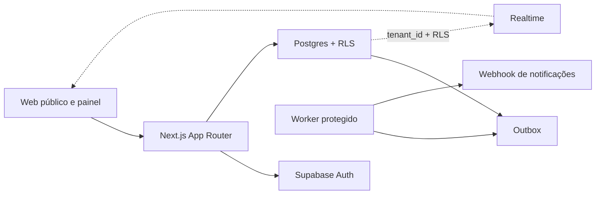
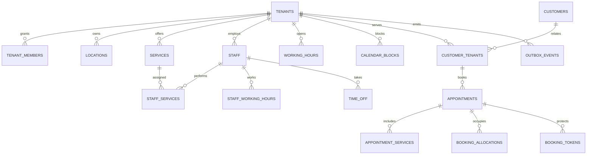

# Arquitetura — Agenda SaaS

## Visão geral

Agenda é monólito modular multi-tenant. Next.js entrega interface e APIs; Supabase
fornece Auth, Postgres, RLS, Storage e Realtime. Disponibilidade, concorrência e
autorização final permanecem no banco.



## Camadas

- `src/app`: páginas, Server Actions e Route Handlers.
- `src/components`: interface acessível sem decisões de segurança.
- `src/features`: consultas e casos de uso por domínio.
- `src/lib`: autenticação, Supabase, segurança e observabilidade.
- `supabase/migrations`: schema, RPCs, constraints, grants e RLS.
- `tests`: unidade, integração, E2E e pgTAP.
- `security`: auditoria Vibe Check e planos de correção.

## Princípios

1. Slug localiza tenant; associação e RLS autorizam.
2. Identidade é validada por `getClaims()` no servidor.
3. APIs privadas retornam `401` sem identidade e `403` sem papel.
4. Datas persistem em UTC; apresentação usa timezone IANA do tenant.
5. Dinheiro persiste em centavos inteiros.
6. Telefone persiste em E.164.
7. Disponibilidade é recalculada dentro da confirmação transacional.
8. `booking_allocations` + GiST impedem sobreposição concorrente.
9. Mutações HTTP baseadas em cookie validam origem.
10. Eventos externos saem pela outbox, nunca dentro da transação de reserva.

## Modelo ativo



Schema ativo possui 30 tabelas. Migration `0016` removeu addons, notas avançadas,
preferências, consentimentos, formulários, lista de espera e tabelas antigas de
notificação porque não possuíam fluxo ativo.

## Fronteiras HTTP

| Grupo | Proteção |
|---|---|
| `/{slug}` e `/api/public/*` | publicação, validação, rate limit e RLS |
| `/api/bookings/{token}/*` | token opaco, janela, origem e RPC |
| `/app/{slug}/*` | sessão, associação, papel e RLS |
| `/api/app/{slug}/*` | `401/403`, origem, tenant e RLS |
| `/api/internal/notifications` | bearer secret + `service_role` somente servidor |

## Outbox

1. Reserva/status grava evento na mesma transação.
2. Worker chama `claim_outbox_events`; linhas recebem lease de cinco minutos.
3. Provedor `dry-run` ou webhook recebe payload normalizado.
4. Sucesso marca `processed_at`.
5. Falha grava código seguro e agenda backoff exponencial.
6. Oito falhas interrompem consumo automático.

Worker não registra nome, telefone ou e-mail. PII existe apenas em memória durante
a entrega necessária.

## Segurança

- CSP e headers globais em `next.config.ts`.
- Segredos somente em módulos servidor e variáveis sem prefixo público.
- RLS habilitada e forçada nas tabelas expostas.
- Funções `security definer` usam `search_path = ''`.
- SQL recebe parâmetros; identificadores dinâmicos de migration usam `%I`.
- JSON-LD converte `<` antes de usar `dangerouslySetInnerHTML`.
- Auditoria completa em `security/AUDIT_SUMMARY.md`.

## Migrations

- `0001–0010`: fundação, tenancy, catálogo, disponibilidade, clientes, agenda,
  operações, RLS, reservas e Storage.
- `0011–0015`: onboarding, administração, reserva interna, Realtime e reagendamento.
- `0016`: simplificação do schema.
- `0017`: lease, conclusão e retry da outbox.
- `0018`: validação de contatos na reserva pública.
- `0019`: publicação Realtime da agenda e dos bloqueios.

Migrations aplicadas não são reescritas. Toda mudança futura recebe novo número,
grants explícitos, teste e atualização de `DATABASE.md`.

## Qualidade

Pipeline obrigatório:

```text
lint -> typecheck -> unit -> build
                 -> Supabase local -> pgTAP -> integração -> E2E
                 -> npm audit --audit-level=high
```

Deploy, domínio, provedores, backups e alertas são configuração operacional externa.
