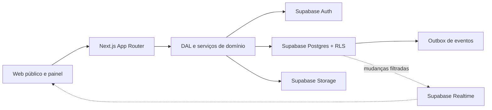

# Arquitetura — Agenda SaaS

## 1. Visão geral

Agenda é um monólito modular multi-tenant. Next.js entrega interface e endpoints; Supabase fornece Auth, Postgres, Storage e Realtime. Regras críticas ficam no servidor ou no banco. Componentes React nunca decidem autorização, disponibilidade final ou prevenção de conflito.



### Camadas

- `app/`: composição de páginas, Server Actions e Route Handlers.
- `components/`: componentes visuais acessíveis e sem regra sensível.
- `features/`: casos de uso e contratos por domínio.
- `lib/`: Supabase, autenticação, permissões, datas, telefone, dinheiro e erros.
- `supabase/migrations/`: schema, constraints, funções, grants e RLS versionados.
- `supabase/seed.sql`: demonstração idempotente para ambiente local.
- `tests/`: unitários, integração de banco e Playwright.

## 2. Decisões técnicas

1. Next.js 16 e `proxy.ts`: Proxy renova cookies; não consulta autorização de negócio. Páginas e mutações autenticadas usam sessão validada e RLS.
2. Supabase SSR: cliente de navegador e cliente de servidor separados. O servidor usa `getClaims()` para identidade; `getSession()` não autoriza ações.
3. UUIDs: chaves opacas geradas pelo Postgres. Slug só localiza tenant; nunca concede acesso.
4. Tempo: instantes em `timestamptz` UTC; timezone IANA salvo no tenant/agendamento. Horários semanais usam `time` local + dia da semana ISO.
5. Dinheiro: centavos inteiros e moeda ISO; nunca ponto flutuante.
6. Telefone: E.164 normalizado antes da persistência. Hash opcional permite busca sem expor telefone em logs.
7. Disponibilidade: leitura pelo motor central; confirmação sempre recalcula na RPC transacional.
8. Concorrência: intervalos ocupados materializados em alocações com `EXCLUDE USING gist`. Constraint é última linha de defesa.
9. RLS: toda tabela em `public` habilita e força RLS. Funções auxiliares de autorização vivem no schema privado `app_private`.
10. Eventos: a transação grava somente `outbox_events`; integrações futuras consomem essa fila sem adicionar tabelas antecipadamente.
11. Cache: páginas públicas estáveis podem revalidar; disponibilidade e páginas autenticadas usam `no-store`.
12. Temas: tokens validados e enums de layout; sem CSS/HTML/JavaScript arbitrário.

## 3. Diagrama de entidades

```mermaid
erDiagram
  TENANTS ||--|| TENANT_PROFILES : has
  TENANTS ||--o{ TENANT_MEMBERS : grants
  TENANTS ||--o{ LOCATIONS : owns
  TENANTS ||--|| BUSINESS_SETTINGS : configures
  TENANTS ||--|| THEME_SETTINGS : styles
  TENANTS ||--o{ AUDIT_LOGS : records

  TENANTS ||--o{ STAFF : employs
  STAFF ||--o{ STAFF_SERVICES : performs
  SERVICES ||--o{ STAFF_SERVICES : assigned
  STAFF ||--o{ STAFF_LOCATIONS : works_at
  LOCATIONS ||--o{ STAFF_LOCATIONS : hosts

  TENANTS ||--o{ SERVICE_CATEGORIES : groups
  SERVICE_CATEGORIES ||--o{ SERVICES : contains
  SERVICES ||--o{ SERVICE_ADDONS : offers
  SERVICES ||--o{ SERVICE_LOCATIONS : available_at
  LOCATIONS ||--o{ SERVICE_LOCATIONS : exposes

  TENANTS ||--o{ RESOURCES : owns
  RESOURCES ||--o{ RESOURCE_SERVICES : required_for
  SERVICES ||--o{ RESOURCE_SERVICES : requires

  TENANTS ||--o{ WORKING_HOURS : opens
  STAFF ||--o{ STAFF_WORKING_HOURS : works
  TENANTS ||--o{ AVAILABILITY_EXCEPTIONS : overrides
  STAFF ||--o{ TIME_OFF : takes

  CUSTOMERS ||--o{ CUSTOMER_TENANTS : relates
  TENANTS ||--o{ CUSTOMER_TENANTS : serves
  CUSTOMER_TENANTS ||--o{ CUSTOMER_NOTES : owns
  CUSTOMER_TENANTS ||--o{ CUSTOMER_PREFERENCES : stores
  CUSTOMER_TENANTS ||--o{ CUSTOMER_CONSENTS : records

  TENANTS ||--o{ APPOINTMENTS : owns
  LOCATIONS ||--o{ APPOINTMENTS : hosts
  STAFF ||--o{ APPOINTMENTS : attends
  CUSTOMER_TENANTS ||--o{ APPOINTMENTS : books
  APPOINTMENTS ||--o{ APPOINTMENT_SERVICES : includes
  SERVICES ||--o{ APPOINTMENT_SERVICES : snapshots
  APPOINTMENTS ||--o{ APPOINTMENT_RESOURCES : reserves
  RESOURCES ||--o{ APPOINTMENT_RESOURCES : allocated
  APPOINTMENTS ||--o{ APPOINTMENT_STATUS_HISTORY : tracks
  APPOINTMENTS ||--o{ APPOINTMENT_NOTES : annotates
  APPOINTMENTS ||--o{ BOOKING_TOKENS : protects

  TENANTS ||--o{ WAITLIST_ENTRIES : collects
  TENANTS ||--o{ FORMS : defines
  FORMS ||--o{ FORM_FIELDS : contains
  SERVICES ||--o{ SERVICE_FORMS : requests
  APPOINTMENTS ||--o{ FORM_RESPONSES : receives

  TENANTS ||--o{ NOTIFICATION_TEMPLATES : defines
  TENANTS ||--o{ NOTIFICATION_JOBS : queues
  NOTIFICATION_JOBS ||--o{ NOTIFICATION_LOGS : attempts
  TENANTS ||--o{ OUTBOX_EVENTS : emits
```



Todas as entidades de negócio possuem `tenant_id` direto. Relações globais, como `customers`, só expõem dados por `customer_tenants`; notas e preferências privadas pertencem à relação com tenant.

## 4. Estrutura de rotas

```text
/
├── login administrativo ou redirecionamento/seletor após autenticação
├── auth/
│   ├── callback          troca PKCE por sessão
│   ├── confirmar         confirma e-mail/recuperação
│   └── sair              encerra sessão
├── app/
│   └── [slug]/
│       ├── page          agenda operacional
│       ├── servicos
│       ├── profissionais
│       ├── clientes
│       ├── relatorios
│       └── configuracoes
├── api/
│   ├── public/availability
│   ├── public/bookings
│   └── bookings/[token]
└── [slug]/
    ├── page              fluxo público
    └── reserva/[token]   cancelar/reagendar
```

`app`, `api`, `auth`, `login`, `admin`, `configuracoes`, `_next`, `favicon.ico` e variações normalizadas são slugs reservados. `/{slug}` só renderiza tenants `published`; preview de rascunho fica sob rota administrativa autenticada.

## 5. Papéis e permissões

| Capacidade | platform_owner | owner | admin | receptionist | professional | viewer |
|---|---:|---:|---:|---:|---:|---:|
| Ler tenant | plataforma | sim | sim | sim | sim | sim |
| Editar tenant/tema/publicação | plataforma | sim | sim | não | não | não |
| Gerir membros e papéis | plataforma | sim | limitado | não | não | não |
| Gerir serviços/equipe/recursos | plataforma | sim | sim | leitura | próprio limitado | leitura |
| Gerir horários e bloqueios | plataforma | sim | sim | sim | próprio | leitura |
| Ler agenda | plataforma | sim | sim | sim | própria | sim |
| Criar/reagendar/cancelar | plataforma | sim | sim | sim | própria conforme política | não |
| Ler/editar clientes operacionais | plataforma | sim | sim | sim | vinculados | leitura limitada |
| Ler notas sensíveis | plataforma auditada | sim | permissão específica | não | não | não |
| Relatórios | plataforma | sim | sim | limitado | próprio | leitura |
| Auditoria/exportação/exclusão | plataforma | sim | limitado | não | não | não |

`platform_owner` é claim controlada no `app_metadata`; papéis de tenant vivem em `tenant_members`. Permissões finas usam `permissions jsonb`, sempre limitadas pelo papel-base.

## 6. Plano de migrations

1. `0001_foundation.sql`: extensões, schemas privados, enums, helpers imutáveis, `updated_at`.
2. `0002_tenancy.sql`: tenants, membros, perfis, unidades, configurações, tema, auditoria.
3. `0003_catalog_staff.sql`: categorias, serviços, adicionais, equipe, recursos e relações.
4. `0004_availability.sql`: horários, exceções, folgas e bloqueios.
5. `0005_customers.sql`: cliente global, relação por tenant, notas, preferências e consentimentos.
6. `0006_appointments.sql`: agendamentos, snapshots, recursos, histórico, notas, tokens e alocações anti-conflito.
7. `0007_operations.sql`: lista de espera, formulários, notificações e outbox.
8. `0008_rls.sql`: grants mínimos, RLS forçada e políticas por papel/tenant.
9. `0009_booking_functions.sql`: consulta de slots e reserva/cancelamento/reagendamento transacionais.
10. `0010_storage.sql`: buckets, limites de MIME/tamanho e políticas de objetos.

Migrations menores são preferidas nas próximas fases. Fundação usa agrupamento por domínio para revisão inicial clara.

## 7. Algoritmo de disponibilidade

Entrada canônica:

```ts
getAvailableSlots({
  tenantId,
  locationId,
  serviceIds,
  staffId,
  dateRange,
  timezone,
})
```

1. Validar UUIDs, intervalo máximo, tenant publicado ou membro autenticado, localização e timezone.
2. Carregar serviços ativos e habilitados na unidade. Calcular duração total, buffers, preço, antecedência e horizonte mais restritivos.
3. Resolver profissionais elegíveis: ativos, vinculados à unidade e a todos os serviços. Se informado, validar profissional; caso contrário ordenar por `sort_order`, carga do dia e UUID.
4. Construir janelas locais do estabelecimento por dia. Aplicar horário especial/fechamento, depois converter limites para instantes UTC.
5. Intersectar janelas do profissional quando ele não herda horário do tenant.
6. Subtrair folgas, férias, bloqueios, agendamentos que ocupam capacidade e exceções negativas.
7. Resolver conjuntos de recursos obrigatórios por tipo/quantidade. Subtrair intervalos já alocados.
8. Gerar inícios pelo `slot_interval_minutes`; aplicar duração + buffers, antecedência, horizonte e capacidade.
9. Para “qualquer profissional”, unir horários equivalentes e manter candidatos ordenados. Expor apenas dados públicos mínimos.
10. Na confirmação, RPC repete validações sob transação, escolhe primeiro candidato ainda livre, grava alocações, histórico e outbox. Violação `23P01` vira conflito amigável.

Pseudo-código:

```text
for day in tenant-local date range
  tenantWindows = weeklyHours overridden by exceptions
  for eligibleStaff in deterministic order
    windows = intersect(tenantWindows, staffWindows)
    busy = timeOff + blocks + activeAppointments + resourceAllocations
    free = subtract(windows, busy)
    emit aligned slots fitting service duration and buffers
deduplicate by instant; retain ordered staff/resource candidates
```

## 8. Segurança de reserva

`booking_allocations` materializa ocupação para cada profissional/recurso. Constraints parciais GiST excluem sobreposição para alocações `active`. Cancelamento muda alocação para `released`; status que não ocupa horário também libera. Locks consultivos por tenant/data reduzem trabalho desperdiçado, mas correção depende das constraints.

RPC pública recebe chave de idempotência, não aceita preço, não aceita `tenant_id` inferido do cliente sem validar slug/localização e não usa `service_role` no navegador. Dados pessoais são normalizados; tokens são armazenados como hash SHA-256 com expiração e uso limitado.

## 9. Riscos e mitigação

- **Conflito simultâneo:** exclusion constraints + transação + teste paralelo.
- **Acesso horizontal:** RLS forçada, helpers privados, tenant explícito e testes com dois JWTs.
- **Recursão em políticas:** helpers `security definer` com `search_path` fixo fora de schemas expostos.
- **Sessão forjada/cacheada:** `getClaims()`, páginas autenticadas dinâmicas e respostas privadas `no-store`.
- **DST/fuso:** biblioteca IANA, cálculo por data local, persistência UTC e testes de mudança de timezone.
- **Slug enumerável:** apenas tenants publicados respondem publicamente; estados privados retornam mesma ausência pública.
- **Dados sensíveis:** notas clínicas isoladas, grants específicos, auditoria sem conteúdo sensível.
- **Spam/abuso:** rate limit por IP + tenant, idempotência, honeypot/CAPTCHA configurável e limites de janela.
- **Outbox presa:** tentativas, `available_at`, lock com `skip locked`, dead-letter e observabilidade.
- **Realtime vazando dados:** publicação restrita, RLS e filtros obrigatórios por `tenant_id`.
- **Seeds confundidos com produção:** executados só em ambiente local, contas fictícias e senha documentada como desenvolvimento.

## 10. Critérios de evolução

Novos canais chamam mesmos contratos de disponibilidade e reserva. Segmentos só mudam seeds e feature flags. Novos recursos reserváveis entram pelo mesmo modelo de alocação; regras específicas não entram em componentes ou rotas.
