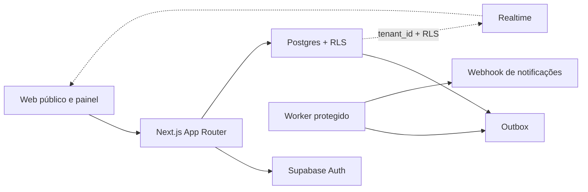
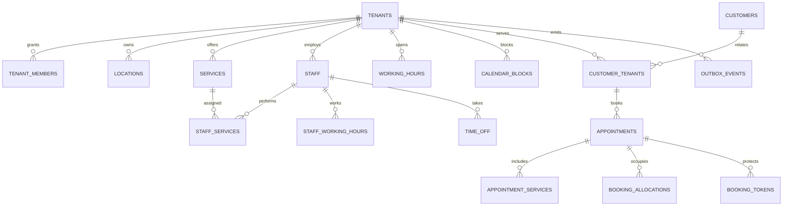
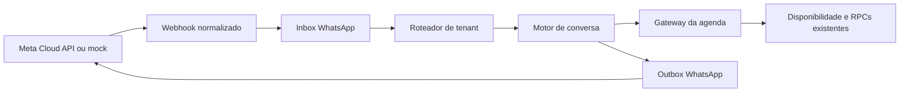

# Arquitetura — Agenda SaaS

## Visão geral

Agenda é monólito modular multi-tenant. Next.js entrega interface e APIs; Supabase
fornece Auth, Postgres, RLS, Storage e Realtime. Disponibilidade, concorrência e
autorização final permanecem no banco.


```mermaid
flowchart LR
  B["Web público e painel"] --> N["Next.js App Router"]
  N --> A["Supabase Auth"]
  N --> D["Postgres + RLS"]
  D --> O["Outbox"]
  W["Worker protegido"] --> O
  W --> P["Webhook de notificações"]
  D -. "tenant_id + RLS" .-> R["Realtime"]
  R -.-> B
```

## Camadas

- `src/app`: páginas, Server Actions e Route Handlers.
- `src/components`: interface acessível sem decisões de segurança.
- `src/features`: consultas e casos de uso por domínio.
- `src/lib`: autenticação, Supabase, segurança e observabilidade.
- `supabase/migrations`: schema, RPCs, constraints, grants e RLS.
- `tests`: unidade, integração, E2E e pgTAP.
- `security`: auditoria Vibe Check e planos de correção.

## Princípios

1. Slug localiza tenant; associação e RLS autorizam.
2. Identidade é validada por `getClaims()` no servidor.
3. APIs privadas retornam `401` sem identidade e `403` sem papel.
4. Datas persistem em UTC; apresentação usa timezone IANA do tenant.
5. Dinheiro persiste em centavos inteiros.
6. Telefone persiste em E.164.
7. Disponibilidade é recalculada dentro da confirmação transacional.
8. `booking_allocations` + GiST impedem sobreposição concorrente.
9. Mutações HTTP baseadas em cookie validam origem.
10. Eventos externos saem pela outbox, nunca dentro da transação de reserva.

## Modelo ativo


```mermaid
erDiagram
  TENANTS ||--o{ TENANT_MEMBERS : grants
  TENANTS ||--o{ LOCATIONS : owns
  TENANTS ||--o{ SERVICES : offers
  TENANTS ||--o{ STAFF : employs
  STAFF ||--o{ STAFF_SERVICES : performs
  SERVICES ||--o{ STAFF_SERVICES : assigned
  TENANTS ||--o{ WORKING_HOURS : opens
  STAFF ||--o{ STAFF_WORKING_HOURS : works
  STAFF ||--o{ TIME_OFF : takes
  TENANTS ||--o{ CALENDAR_BLOCKS : blocks
  CUSTOMERS ||--o{ CUSTOMER_TENANTS : relates
  TENANTS ||--o{ CUSTOMER_TENANTS : serves
  CUSTOMER_TENANTS ||--o{ APPOINTMENTS : books
  APPOINTMENTS ||--o{ APPOINTMENT_SERVICES : includes
  APPOINTMENTS ||--o{ BOOKING_ALLOCATIONS : occupies
  APPOINTMENTS ||--o{ BOOKING_TOKENS : protects
  TENANTS ||--o{ OUTBOX_EVENTS : emits
```

Schema público ativo possui 47 tabelas. Migration `0016` removeu addons, notas avançadas,
preferências, consentimentos, formulários, lista de espera e tabelas antigas de
notificação porque não possuíam fluxo ativo.

## Fronteiras HTTP

| Grupo | Proteção |
|---|---|
| `/{slug}` e `/api/public/*` | publicação, validação, rate limit e RLS |
| `/api/bookings/{token}/*` | token opaco, janela, origem e RPC |
| `/app/{slug}/*` | sessão, associação, papel e RLS |
| `/api/app/{slug}/*` | `401/403`, origem, tenant e RLS |
| `/api/internal/notifications` | bearer secret + `service_role` somente servidor |

## Outbox

1. Reserva/status grava evento na mesma transação.
2. Worker chama `claim_outbox_events`; linhas recebem lease de cinco minutos.
3. Provedor `dry-run` local ou webhook em produção recebe payload normalizado; o
   webhook HTTPS usa o ID do evento como chave de idempotência e não segue
   redirects.
4. Sucesso marca `processed_at`.
5. Falha grava código de lista fechada e agenda backoff exponencial.
6. Tentativas intermediárias selecionadas geram `warn`; a oitava gera `error` e
   interrompe o consumo automático.

Rejeições permanentes geram `error` já na primeira ocorrência. O backoff continua
até o limite da outbox; encerramento antecipado exige uma transição terminal própria
no banco.

Worker não registra nome, telefone ou e-mail. PII existe apenas em memória durante
a entrega necessária.

## Canal WhatsApp

WhatsApp entra como canal do mesmo núcleo de agendamentos. Webhook e simulador
normalizam eventos para contratos internos; roteamento e máquina de estados não
dependem de payload Meta nem de componentes React.


```mermaid
flowchart LR
  P["Meta Cloud API ou mock"] --> H["Webhook normalizado"]
  H --> I["Inbox WhatsApp"]
  I --> T["Roteador de tenant"]
  T --> C["Motor de conversa"]
  C --> G["Gateway da agenda"]
  G --> D["Disponibilidade e RPCs existentes"]
  C --> O["Outbox WhatsApp"]
  O --> P
```

O primeiro estágio usa provedor mock. A conta Meta, aplicativo, WABA, número real,
webhook remoto e templates aprovados continuam pendentes. A interface global expõe
essa diferença e não apresenta o canal real como ativo.

O painel `/app/platform/*` exige claim `app_metadata.platform_owner` validada no
servidor. Painéis `/app/{slug}/*` continuam exigindo associação ao tenant. Conversas
sem tenant resolvido pertencem ao contexto da plataforma; após resolução, RLS limita
acesso ao estabelecimento correto.

O webhook aplica rate limit persistente por IP confiável e rota antes de ler o
corpo, limita o stream a 1 MiB e valida HMAC sobre os bytes originais. Depois da
assinatura, o adaptador extrai chaves SHA-256 por receptor/contato. Head of line vale
somente para streams sobrepostos; acima de 256 chaves, um wildcard do provider
serializa o envelope sem truncar ou rejeitar eventos. Fragmento inválido é isolado e
não elimina siblings válidos.

Troca de tenant fecha a conversa anterior e move somente o inbound decisório para
uma sucessora sem tenant. Código, opções e confirmação do novo estabelecimento ficam
invisíveis ao tenant anterior. A atribuição ocorre apenas após a escolha do cliente.

Retenção roda em lotes por rota interna autenticada. A policy privada define TTL de
payload bruto, transporte e conteúdo conversacional, além de `legal_hold`. O job
fecha sessões abandonadas, redige conteúdo antigo e remove filas terminais sem apagar
o ledger técnico necessário para auditoria.

O modelo admite número central compartilhado, número exclusivo, número próprio e
vários números por tenant. Código de roteamento identifica contexto público e não
autoriza operações. Provedores reais recebem referências de segredo; credenciais não
entram no banco em texto simples nem no navegador.

Decisão completa: [ADR 0001](adr/0001-whatsapp-cloud-api-channel.md). Ativação real:
[checklist da Meta](whatsapp-meta-activation.md).

## Segurança

- CSP e headers globais em `next.config.ts`.
- Segredos somente em módulos servidor e variáveis sem prefixo público.
- RLS habilitada e forçada nas tabelas expostas.
- Funções `security definer` usam `search_path = ''`.
- SQL recebe parâmetros; identificadores dinâmicos de migration usam `%I`.
- JSON-LD converte `<` antes de usar `dangerouslySetInnerHTML`.
- Auditoria completa em `security/AUDIT_SUMMARY.md`.

## Migrations

- `0001–0010`: fundação, tenancy, catálogo, disponibilidade, clientes, agenda,
  operações, RLS, reservas e Storage.
- `0011–0015`: onboarding, administração, reserva interna, Realtime e reagendamento.
- `0016`: simplificação do schema.
- `0017`: lease, conclusão e retry da outbox.
- `0018`: validação de contatos na reserva pública.
- `0019`: publicação Realtime da agenda e dos bloqueios.
- `0020`: fundação oficial do canal WhatsApp, inbox, outbox, conversa e RLS.
- `0021`: leases e claims por provider, transições atômicas, lock de conversa,
  status fora de ordem e dead letter.
- `0022`: gateway transacional da agenda, consentimento web, templates e
  notificações WhatsApp.
- `0023`: rate limit persistente do webhook antes da autenticação do payload.
- `0024`: policy de retenção, legal hold, sweep e redação/exclusão em lotes.

Migrations aplicadas não são reescritas. Toda mudança futura recebe novo número,
grants explícitos, teste e atualização de `DATABASE.md`.

## Qualidade

Pipeline obrigatório:

```text
lint -> typecheck -> unit -> build
                 -> Supabase local -> pgTAP -> integração -> E2E
                 -> npm audit --omit=dev --audit-level=high
```

O audit completo também é monitorado. No estado atual, tanto a árvore de produção
quanto a árvore completa registram zero vulnerabilidades conhecidas.

Deploy, domínio, provedores, backups e alertas são configuração operacional externa.
