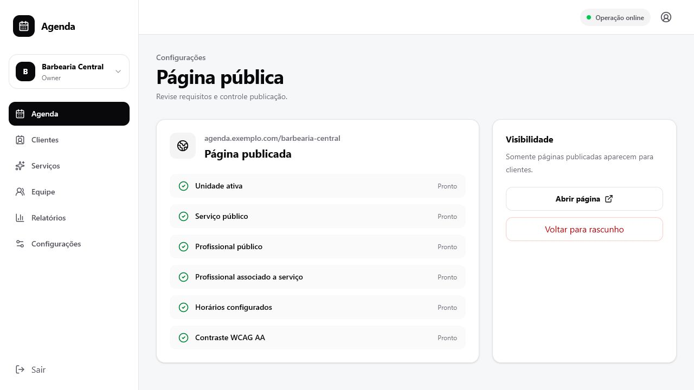
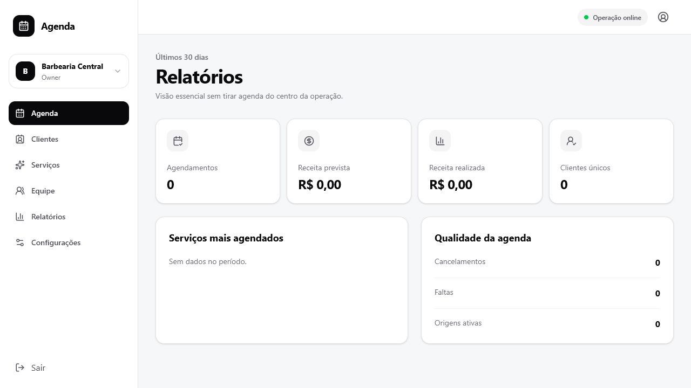

# Guia do proprietário

Manual rápido para administrar o estabelecimento no Agenda.

## 1. Entrar no sistema

Abra o endereço administrativo fornecido pela sua equipe, informe e-mail e senha e
selecione o estabelecimento quando sua conta tiver acesso a mais de um.

Use **Esqueci minha senha** para receber um link de redefinição. Não compartilhe sua
senha e encerre a sessão em computadores compartilhados.

## 2. Acompanhar a agenda

Na tela **Agenda** você pode:

- Alternar entre dia, semana e mês.
- Avançar ou voltar o período.
- Filtrar por profissional.
- Criar um agendamento administrativo.
- Bloquear um horário indisponível.
- Aprovar, recusar, confirmar check-in, registrar falta ou cancelar.

Agendamentos novos aparecem automaticamente quando o Realtime está conectado.

## 3. Criar um agendamento

1. Selecione **Novo agendamento**.
2. Escolha serviço e profissional.
3. Informe a data e selecione um horário disponível.
4. Localize ou cadastre o cliente.
5. Revise preço e duração.
6. Confirme.

Se o horário acabou de ser ocupado, escolha outro slot. O sistema impede reservas
sobrepostas.

## 4. Bloquear um horário

Use **Bloquear** para almoço especial, reunião, manutenção ou indisponibilidade. O
bloqueio participa da mesma regra de concorrência dos agendamentos.

## 5. Clientes

A tela **Clientes** mostra apenas registros do estabelecimento atual. Pesquise por
nome ou telefone. Evite registrar dados sensíveis desnecessários.

## 6. Serviços

Em **Serviços** você consulta preço, duração, publicação e profissionais associados.
Para criar um serviço, informe nome, duração em minutos e preço. Desative serviços
que não devem mais receber reservas.

## 7. Equipe

Em **Equipe** você consulta profissionais, situação pública e serviços habilitados.
Somente profissionais ativos, públicos e associados ao serviço aparecem para o
cliente.

## 8. Página pública

O cliente escolhe serviço, profissional, data e horário sem criar senha. Depois
informa apenas os dados necessários e confirma.

Compartilhe sempre o endereço público oficial do estabelecimento.

## 9. Publicação

Em **Configurações**, o checklist confirma:

- Unidade ativa.
- Serviço público.
- Profissional público.
- Associação entre profissional e serviço.
- Horários configurados.
- Contraste visual adequado.

Publique somente quando todos os itens estiverem prontos. Use **Voltar para
rascunho** para ocultar temporariamente a página pública.

## 10. Relatórios

Os relatórios mostram os últimos 30 dias: agendamentos, receitas, clientes únicos,
serviços mais agendados, cancelamentos e faltas.

## 11. Boas práticas

- Revise diariamente confirmações pendentes.
- Use bloqueios em vez de deixar horários incorretos disponíveis.
- Mantenha serviços, equipe e expediente atualizados.
- Não compartilhe contas entre pessoas.
- Use os dados de clientes apenas para administrar atendimentos.
- Confirme o estabelecimento selecionado antes de alterar dados.

## 12. Ajuda rápida

| Situação | Ação recomendada |
|---|---|
| Não consigo entrar | Redefina a senha e confirme o e-mail usado |
| Cliente não vê horários | Revise expediente, profissional, bloqueios e antecedência |
| Serviço não aparece | Confirme que está ativo e público |
| Profissional não aparece | Confirme status público e associação ao serviço |
| Página pública não abre | Revise o checklist de publicação |
| Horário ficou indisponível | Outro agendamento ou bloqueio ocupou o intervalo |

Em caso de dúvida, envie ao suporte o nome do estabelecimento, a tela acessada e o
horário aproximado do problema. Nunca envie senha ou chave de API.
