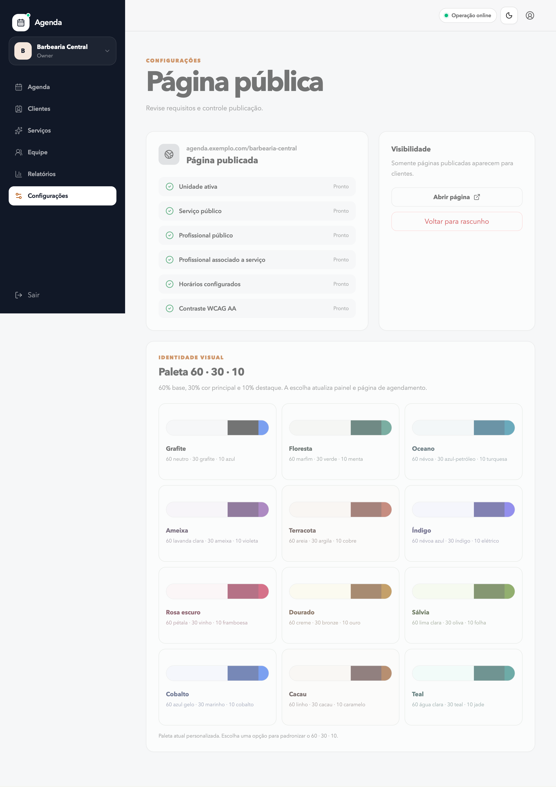
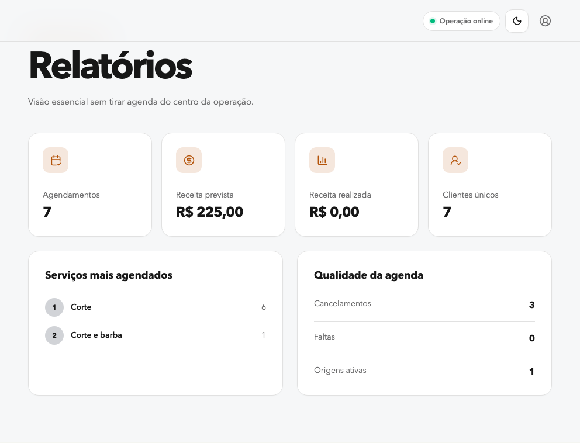

# Guia do proprietário

Manual rápido para administrar o estabelecimento no Agenda.

## 1. Entrar no sistema

Abra o endereço administrativo fornecido pela sua equipe, informe e-mail e senha e
selecione o estabelecimento quando sua conta tiver acesso a mais de um.

Use **Esqueci minha senha** para receber um link de redefinição. Não compartilhe sua
senha e encerre a sessão em computadores compartilhados.

## 2. Acompanhar a agenda

Na tela **Agenda** você pode:

- Alternar entre dia, semana e mês.
- Avançar ou voltar o período.
- Filtrar por profissional.
- Criar um agendamento administrativo.
- Bloquear um horário indisponível.
- Aprovar, recusar, confirmar check-in, registrar falta ou cancelar.

Agendamentos novos aparecem automaticamente quando o Realtime está conectado.

## 3. Criar um agendamento

1. Selecione **Novo agendamento**.
2. Escolha serviço e profissional.
3. Informe a data e selecione um horário disponível.
4. Localize ou cadastre o cliente.
5. Revise preço e duração.
6. Confirme.

Se o horário acabou de ser ocupado, escolha outro slot. O sistema impede reservas
sobrepostas.

## 4. Bloquear um horário

Use **Bloquear** para almoço especial, reunião, manutenção ou indisponibilidade. O
bloqueio participa da mesma regra de concorrência dos agendamentos.

## 5. Clientes

A tela **Clientes** mostra apenas registros do estabelecimento atual. Pesquise por
nome ou telefone. Evite registrar dados sensíveis desnecessários.

## 6. Serviços

Em **Serviços** você consulta preço, duração, publicação e profissionais associados.
Para criar um serviço, informe nome, duração em minutos e preço. Desative serviços
que não devem mais receber reservas.

## 7. Equipe

Em **Equipe** você consulta profissionais, situação pública e serviços habilitados.
Somente profissionais ativos, públicos e associados ao serviço aparecem para o
cliente.

## 8. Página pública

O cliente escolhe serviço, profissional, data e horário sem criar senha. Depois
informa apenas os dados necessários e confirma.

Compartilhe sempre o endereço público oficial do estabelecimento.

## 9. Publicação

Em **Configurações**, o checklist confirma:

- Unidade ativa.
- Serviço público.
- Profissional público.
- Associação entre profissional e serviço.
- Horários configurados.
- Contraste visual adequado.

Publique somente quando todos os itens estiverem prontos. Use **Voltar para
rascunho** para ocultar temporariamente a página pública.

## 10. Identidade visual

Owners e admins podem escolher uma das 12 paletas prontas. A faixa mostra a
proporção 60% base, 30% cor principal e 10% destaque antes de aplicar.

A paleta escolhida muda o painel administrativo e a página pública de
agendamento. A preferência de tema claro ou escuro continua sendo individual de
cada dispositivo.

## 11. Relatórios

Os relatórios mostram os últimos 30 dias: agendamentos, receitas, clientes únicos,
serviços mais agendados, cancelamentos e faltas.

## 12. WhatsApp: acompanhar as conversas ao vivo

Em **WhatsApp › Conversas** você acompanha, sem recarregar a página, o cliente
escrevendo e o bot respondendo. É uma tela de leitura: nada é enviado por ali.

- A lista mostra as conversas do seu estabelecimento, da mais recente para a mais
  antiga, com a última mensagem e o selo **Aguardando resposta** quando o cliente
  falou por último.
- Ao abrir uma conversa, o cabeçalho diz em que etapa ela está e traz o selo da
  **janela de 24h**. Fora dessa janela o WhatsApp só permite modelos aprovados —
  é o motivo mais comum de o bot parecer mudo.
- Mensagens antigas apagadas pela política de retenção aparecem como
  "Conteúdo removido", com o horário preservado.
- Se a atualização ao vivo cair, aparece um aviso e o botão **Atualizar** continua
  trazendo o que chegou.

Quem só tem a permissão de atendimento humano vê apenas as conversas encaminhadas
para a equipe.

**Número compartilhado:** vários estabelecimentos podem usar o mesmo número da
plataforma, e você só enxerga as conversas do seu. Enquanto um cliente está em
conversa com outro estabelecimento, ele não aparece na sua lista — quando essa
conversa encerra e ele procura você, a conversa nova aparece normalmente.

## 13. WhatsApp: botões ou texto

O canal WhatsApp atende de duas formas. A escolha é feita ao criar o
estabelecimento e pode ser mudada depois em **Configurações › WhatsApp**.

- **Botões e listas**: o cliente toca nas opções. Se digitar algo numa pergunta de
  escolha, o bot repete as opções.
- **Somente texto**: não há botões. O cliente escreve como quiser e o bot responde
  como uma pessoa: entende serviço, profissional, dia, horário e período ("de
  tarde"), repete o que entendeu e pergunta só o que falta. Exemplo:

  > Cliente: *Corte e barba com Raul hj*
  > Bot: *Beleza, corte e barba hoje. Só não achei ninguém chamado Raul por aqui.
  > Corte e barba quem faz é Rafael e Diego. Prefere algum deles ou tanto faz?*
  > Cliente: *tanto faz*
  > Bot: *Beleza! Você quer corte e barba hoje, certo? Olha, hoje a gente ainda tem
  > 14:00, 15:30 e 16:00. Qual prefere?*

Quando a plataforma está com a interpretação por IA ligada, frases mais soltas
("queria ver se rola um horário pra minha filha na sexta lá pelas duas") também são
entendidas; a mensagem é enviada ao provedor de IA configurado apenas para extrair
serviço, dia e horário — a resposta ao cliente continua sendo do sistema. Se o
provedor falhar, o bot segue funcionando com as regras internas.

O modo texto entende gírias e abreviações comuns ("hj", "amn", "sex", "14 e meia",
"blz"), respostas como "sim", "pode confirmar", "não, outro horário" ou "cancela",
e atalhos como "o primeiro" e "o último" ao escolher horário. Se o horário pedido
não existir, ele oferece os mais próximos do dia. Se o cliente citar um profissional
que não existe, o bot avisa e lista quem atende. Se houver dois profissionais com o
mesmo nome, ele pergunta qual. As alternativas aparecem na própria frase; só listas
muito longas viram itens. Em qualquer modo, "Menu", "Cancelar" e "Atendente"
continuam funcionando.

## 14. Boas práticas

- Revise diariamente confirmações pendentes.
- Use bloqueios em vez de deixar horários incorretos disponíveis.
- Mantenha serviços, equipe e expediente atualizados.
- Não compartilhe contas entre pessoas.
- Use os dados de clientes apenas para administrar atendimentos.
- Confirme o estabelecimento selecionado antes de alterar dados.

## 15. Ajuda rápida

| Situação | Ação recomendada |
|---|---|
| Não consigo entrar | Redefina a senha e confirme o e-mail usado |
| Cliente não vê horários | Revise expediente, profissional, bloqueios e antecedência |
| Serviço não aparece | Confirme que está ativo e público |
| Profissional não aparece | Confirme status público e associação ao serviço |
| Página pública não abre | Revise o checklist de publicação |
| Horário ficou indisponível | Outro agendamento ou bloqueio ocupou o intervalo |
| Bot do WhatsApp não entende as frases | Confirme o modo "Somente texto" em Configurações › WhatsApp; no modo Botões o texto digitado só repete as opções |
| Cliente pediu um profissional que não existe | O bot avisa e lista quem atende; confira se o nome no cadastro é o que os clientes usam (apelido) |

Em caso de dúvida, envie ao suporte o nome do estabelecimento, a tela acessada e o
horário aproximado do problema. Nunca envie senha ou chave de API.
