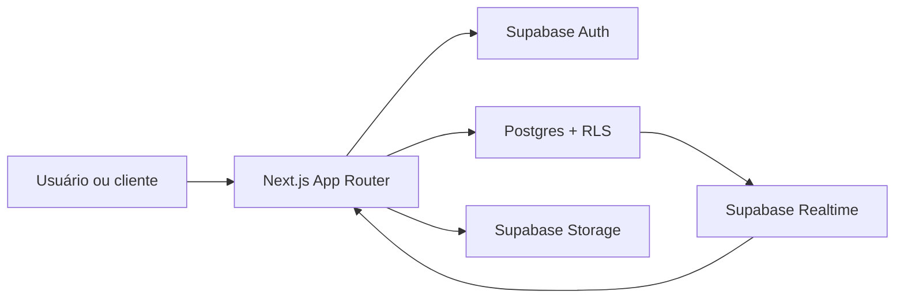
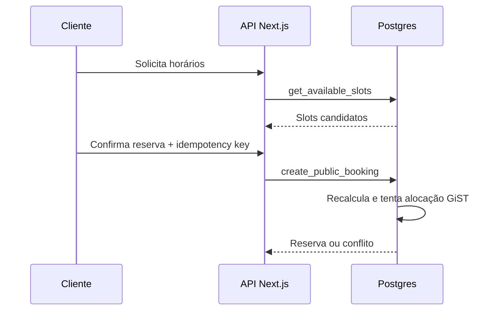

# Documentação técnica

## 1. Visão geral

Agenda é uma aplicação Next.js conectada ao Supabase. O navegador renderiza a
interface, enquanto autenticação SSR, autorização, consultas privadas e mutações
passam pelo servidor. Regras críticas de disponibilidade e concorrência vivem no
Postgres.



## 2. Responsabilidades por camada

| Camada | Responsabilidade |
|---|---|
| `src/app` | Rotas, páginas, Server Actions e APIs |
| `src/components` | Interface e estado interativo |
| `src/features` | Consultas e regras por domínio |
| `src/lib` | Ambiente, autenticação, Supabase e utilitários |
| `supabase/migrations` | Schema, funções, RLS e índices |
| `tests` | Unidade, integração, E2E e banco |

Server Components são o padrão. Componentes cliente são usados em formulários,
Realtime e fluxos com estado local.

## 3. Configuração

Requisitos:

- Node.js 22.14 ou superior.
- npm 10 ou superior.
- Docker Desktop para a stack local do Supabase.

Variáveis:

```dotenv
NEXT_PUBLIC_SUPABASE_URL=https://PROJECT_REF.supabase.co
NEXT_PUBLIC_SUPABASE_PUBLISHABLE_KEY=sb_publishable_...
NEXT_PUBLIC_APP_URL=http://localhost:3000
SUPABASE_SERVICE_ROLE_KEY=server-only-when-required
BOOKING_TOKEN_PEPPER=at-least-32-random-characters
```

`NEXT_PUBLIC_*` entra no bundle. `SUPABASE_SERVICE_ROLE_KEY` e peppers nunca podem
ser expostos ao navegador.

Instalação local:

```bash
npm install
npx supabase start
npx supabase db reset
npm run dev
```

## 4. Autenticação SSR

1. O formulário chama `loginAction`.
2. `signInWithPassword` cria a sessão Supabase.
3. O proxy renova cookies expirados.
4. `getCurrentUser()` valida claims no servidor.
5. `requireTenantAccess(slug)` busca associação ativa e papel.
6. RLS aplica a última barreira no banco.

Usuário de um único tenant é redirecionado diretamente. Usuário com múltiplas
associações recebe o seletor de estabelecimento.

## 5. Multi-tenancy e RLS

Entidades de negócio possuem `tenant_id`. Funções privadas verificam associação e
papel. Políticas públicas expõem somente estabelecimentos publicados e catálogo
marcado como público.

Princípios:

- `auth.uid()` identifica o usuário.
- `tenant_members` define papel e associação.
- Owners e admins administram o tenant; isso não autoriza outro tenant.
- Filtros da aplicação melhoram precisão, mas RLS permanece obrigatória.

## 6. Banco de dados

O schema ativo possui 30 tabelas, descritas em [DATABASE.md](DATABASE.md). A
migration `0016_simplify_schema.sql` remove módulos sem fluxo ativo.

Áreas principais:

- Organização e acesso.
- Catálogo, equipe e recursos.
- Disponibilidade.
- Clientes.
- Agenda e tokens.
- Infraestrutura operacional.

Migrations devem ser incrementais. Alterações de função precisam preservar grants,
`security definer`, `search_path` vazio e compatibilidade das assinaturas usadas no
TypeScript.

## 7. Disponibilidade e concorrência

`get_available_slots` considera timezone, expediente, profissional, bloqueios,
folgas, exceções, duração, buffers e capacidade. A confirmação chama novamente a
regra dentro da transação.

`booking_allocations` materializa intervalos como `tstzrange`. Uma exclusion
constraint GiST impede sobreposição, inclusive sob duas requisições simultâneas.



## 8. Fluxos principais

### Reserva pública

- `GET /{slug}` carrega tenant, tema, unidade, serviços e equipe públicos.
- `/api/public/availability` aplica rate limit e consulta slots.
- `/api/public/bookings` valida dados e cria reserva atômica.
- O token de gestão é apresentado uma vez; só o hash é persistido.

### Operação administrativa

- `/app/{slug}` lista agenda por período.
- Actions alteram status, criam bloqueios e mantêm cache coerente.
- Realtime invalida a visualização do tenant sem decidir consistência.

### Cancelamento e reagendamento

- Rotas sob `/api/bookings/{token}` usam token opaco.
- Janela e regras vêm das configurações do estabelecimento.
- Reagendamento cria a nova reserva e relaciona origem/destino na mesma operação.

## 9. Rotas

| Rota | Finalidade |
|---|---|
| `/` | Login ou seleção de tenant |
| `/{slug}` | Página pública de reserva |
| `/app/{slug}` | Agenda administrativa |
| `/app/{slug}/clientes` | Clientes do tenant |
| `/app/{slug}/servicos` | Catálogo |
| `/app/{slug}/profissionais` | Equipe |
| `/app/{slug}/relatorios` | Indicadores de 30 dias |
| `/app/{slug}/configuracoes` | Checklist e publicação |
| `/onboarding` | Criação inicial do estabelecimento |
| `/auth/callback` | Troca de código por sessão |

## 10. Testes e qualidade

```bash
npm run lint
npm run typecheck
npm run test
npm run build
npm run validate
```

Testes dependentes do banco:

```bash
RUN_DB_TESTS=1 npm run test:integration
RUN_E2E_DB=1 npm run test:e2e
npm run test:db
```

O teste de concorrência exige um sucesso e um conflito quando duas reservas tentam
ocupar o mesmo profissional e intervalo.

## 11. Deploy

1. Crie o projeto Supabase e aplique migrations na ordem.
2. Configure URL, chave publicável e secrets no provedor.
3. Configure URLs de redirect do Auth.
4. Execute `npm run validate`.
5. Faça build e deploy do Next.js.
6. Valide login, página pública, reserva e isolamento entre tenants.
7. Ative SMTP, backups, alertas, CAPTCHA e MFA conforme o risco.

## 12. Observabilidade e incidentes

- Verifique logs do Next.js e do Supabase.
- Para falha de login, confirme URL, chave, usuário e redirect URLs.
- Para `PGRST201`, explicite a foreign key no relacionamento embutido.
- Para conflito `23P01`, informe indisponibilidade e solicite novo horário.
- Para dados invisíveis, confirme publicação, associação e policy RLS.
- Nunca desabilite RLS como correção temporária em produção.

## 13. Referências internas

- [Arquitetura detalhada](ARCHITECTURE.md)
- [Banco de dados](DATABASE.md)
- [Status de implementação](IMPLEMENTATION_STATUS.md)
- [Guia do proprietário](OWNER_GUIDE.md)
- [Instruções para agentes](../AGENTS.md)
