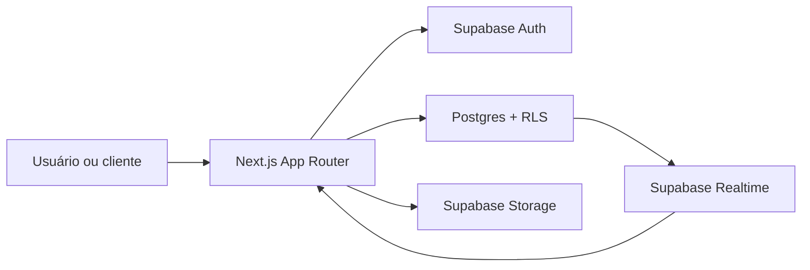
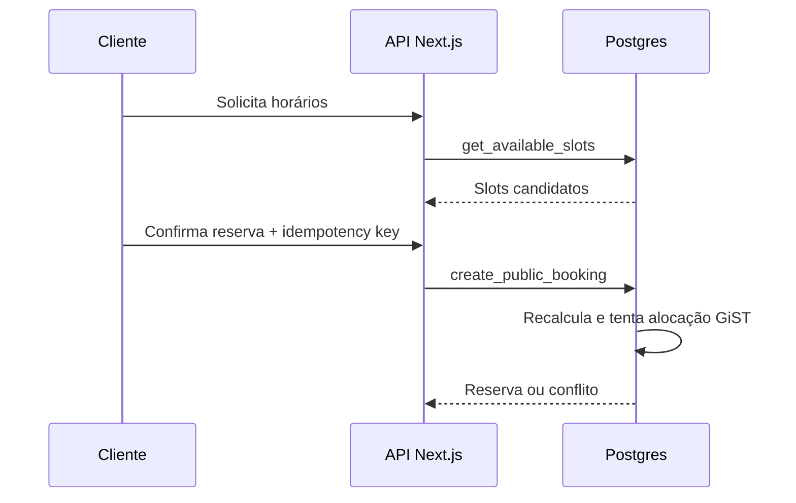

# Documentação técnica

## 1. Visão geral

Agenda é uma aplicação Next.js conectada ao Supabase. O navegador renderiza a
interface, enquanto autenticação SSR, autorização, consultas privadas e mutações
passam pelo servidor. Regras críticas de disponibilidade e concorrência vivem no
Postgres.


```mermaid
flowchart LR
  U["Usuário ou cliente"] --> N["Next.js App Router"]
  N --> A["Supabase Auth"]
  N --> D["Postgres + RLS"]
  N --> S["Supabase Storage"]
  D --> R["Supabase Realtime"]
  R --> N
```

## 2. Responsabilidades por camada

| Camada | Responsabilidade |
|---|---|
| `src/app` | Rotas, páginas, Server Actions e APIs |
| `src/components` | Interface e estado interativo |
| `src/features` | Consultas e regras por domínio |
| `src/lib` | Ambiente, autenticação, Supabase e utilitários |
| `supabase/migrations` | Schema, funções, RLS e índices |
| `tests` | Unidade, integração, E2E e banco |

Server Components são o padrão. Componentes cliente são usados em formulários,
Realtime e fluxos com estado local.

A interface usa `prefers-color-scheme` na primeira visita e permite alternar
manualmente entre tema claro e escuro. A preferência fica somente no `localStorage`
do dispositivo. No modo escuro, o canvas usa preto verdadeiro (`#000000`), superfícies
elevadas usam pretos neutros e os estados semânticos mantêm contraste próprio. A
página pública preserva as cores de marca do tenant, mas adapta fundo, superfície,
texto e bordas ao tema escolhido.

Owners e admins escolhem, em Configurações, uma das 12 paletas acessíveis de 60–30–10. A
seleção grava os cinco tokens existentes em `theme_settings`; o shell administrativo
e a página pública consomem os mesmos tokens. O formulário só aceita IDs de paletas
pré-definidas no servidor, com checagem de papel e escopo do tenant.

## 3. Configuração

Requisitos:

- Node.js 22.14 ou superior.
- npm 10 ou superior.
- Docker Desktop para a stack local do Supabase.

Variáveis:

```dotenv
NEXT_PUBLIC_SUPABASE_URL=https://PROJECT_REF.supabase.co
NEXT_PUBLIC_SUPABASE_PUBLISHABLE_KEY=sb_publishable_...
NEXT_PUBLIC_APP_URL=http://localhost:3000
SUPABASE_SERVICE_ROLE_KEY=server-only-when-required
BOOKING_TOKEN_PEPPER=at-least-32-random-characters
TRUSTED_CLIENT_IP_HEADER=x-real-ip
NOTIFICATION_WORKER_SECRET=at-least-32-random-characters
NOTIFICATION_MODE=dry-run
NOTIFICATION_WEBHOOK_URL=https://provider.example/events
NOTIFICATION_WEBHOOK_SECRET=provider-secret
WHATSAPP_ENABLED=false
WHATSAPP_PROVIDER=mock
WHATSAPP_GRAPH_API_VERSION=
WHATSAPP_WEBHOOK_VERIFY_TOKEN=
WHATSAPP_APP_SECRET=
WHATSAPP_PLATFORM_ACCESS_TOKEN=
WHATSAPP_DEFAULT_PHONE_NUMBER_ID=
WHATSAPP_DEFAULT_WABA_ID=
WHATSAPP_SIMULATOR_ENABLED=true
WHATSAPP_WORKER_SECRET=at-least-32-random-characters
```

O modo `dry-run` é exclusivo do ambiente local. Produção exige `webhook`, URL e
segredo do provedor. A URL do webhook deve usar HTTPS, sem credenciais embutidas.

WhatsApp inicia desativado para tráfego real e usa provedor mock no desenvolvimento.
Configuração do canal fica somente no servidor. App secret, verify token e access
token não usam prefixo `NEXT_PUBLIC_`; componentes recebem apenas booleanos de
prontidão e identificadores públicos. Produção deve recusar ativação parcial.

`NEXT_PUBLIC_*` entra no bundle. `SUPABASE_SERVICE_ROLE_KEY`, peppers e segredos de
worker/provedor nunca podem ser expostos ao navegador. Em produção, o pepper é
obrigatório. Header de IP só deve ser configurado quando o proxy remover valores
enviados pelo cliente.

Instalação local:

```bash
npm install
npx supabase start
npx supabase db reset
npm run dev
```

## 4. Autenticação SSR

1. O formulário chama `loginAction`.
2. `signInWithPassword` cria a sessão Supabase.
3. O proxy renova cookies expirados.
4. `getCurrentUser()` valida claims no servidor.
5. `requireTenantAccess(slug)` busca associação ativa e papel.
6. RLS aplica a última barreira no banco.

Usuário de um único tenant é redirecionado diretamente. Usuário com múltiplas
associações recebe o seletor de estabelecimento.

## 5. Multi-tenancy e RLS

Entidades de negócio possuem `tenant_id`. Funções privadas verificam associação e
papel. Políticas públicas expõem somente estabelecimentos publicados e catálogo
marcado como público.

Princípios:

- `auth.uid()` identifica o usuário.
- `tenant_members` define papel e associação.
- Owners e admins administram o tenant; isso não autoriza outro tenant.
- Filtros da aplicação melhoram precisão, mas RLS permanece obrigatória.

## 6. Banco de dados

O schema ativo possui 45 tabelas, descritas em [DATABASE.md](DATABASE.md). A
migration `0016_simplify_schema.sql` remove módulos sem fluxo ativo.

Áreas principais:

- Organização e acesso.
- Catálogo, equipe e recursos.
- Disponibilidade.
- Clientes.
- Agenda e tokens.
- Infraestrutura operacional.

Migrations devem ser incrementais. Alterações de função precisam preservar grants,
`security definer`, `search_path` vazio e compatibilidade das assinaturas usadas no
TypeScript.

## 7. Disponibilidade e concorrência

`get_available_slots` considera timezone, expediente, profissional, bloqueios,
folgas, exceções, duração, buffers e capacidade. A confirmação chama novamente a
regra dentro da transação.

`booking_allocations` materializa intervalos como `tstzrange`. Uma exclusion
constraint GiST impede sobreposição, inclusive sob duas requisições simultâneas.


```mermaid
sequenceDiagram
  participant C as Cliente
  participant API as API Next.js
  participant DB as Postgres
  C->>API: Solicita horários
  API->>DB: get_available_slots
  DB-->>API: Slots candidatos
  C->>API: Confirma reserva + idempotency key
  API->>DB: create_public_booking
  DB->>DB: Recalcula e tenta alocação GiST
  DB-->>API: Reserva ou conflito
```

## 8. Fluxos principais

### Reserva pública

- `GET /{slug}` carrega tenant, tema, unidade, serviços e equipe públicos.
- `/api/public/availability` aplica rate limit e consulta slots.
- `/api/public/bookings` valida dados e cria reserva atômica.
- O token de gestão é apresentado uma vez; só o hash é persistido.

### Operação administrativa

- `/app/{slug}` lista agenda por período.
- Actions alteram status, criam bloqueios e mantêm cache coerente.
- Realtime invalida a visualização do tenant sem decidir consistência.

### Cancelamento e reagendamento

- Rotas sob `/api/bookings/{token}` usam token opaco.
- Janela e regras vêm das configurações do estabelecimento.
- Reagendamento cria a nova reserva e relaciona origem/destino na mesma operação.

### Notificações

- A transação grava `outbox_events`.
- `POST /api/internal/notifications` exige bearer secret.
- O worker valida o provedor antes de reclamar eventos da outbox.
- O worker reclama eventos com lease, usa `dry-run` apenas local ou webhook e conclui.
- O webhook recebe `Idempotency-Key` com o ID do evento para deduplicar retries.
- Rejeições permanentes geram `error` na primeira ocorrência; erros transitórios
  usam `warn` nos marcos de retry.
- Falha aplica backoff; depois de oito tentativas o evento exige intervenção.

### WhatsApp

- `/api/integrations/whatsapp/webhook` recebe eventos oficiais quando configurado.
- Rate limit persistente usa o IP definido por `TRUSTED_CLIENT_IP_HEADER`; o proxy
  deve substituir esse header e remover valores enviados pelo cliente.
- Inbox deduplica, calcula ordenação por stream e persiste evento antes do
  processamento assíncrono.
- Roteador usa número receptor, código, sessão e histórico para resolver tenant.
- Máquina de estados produz respostas abstratas de texto, botão, lista e template.
  O contrato de Flow existe para evolução, mas o envio falha fechado enquanto a
  integração estiver desativada.
- Cada estabelecimento escolhe o modo de interação
  (`tenant_whatsapp_settings.metadata.interaction_mode`): `buttons` envia botões e
  listas e trata texto digitado em pergunta de escolha como entrada inválida; `text`
  nunca envia interativo e interpreta cada mensagem com regras determinísticas
  (`domain/intent/`: serviço, profissional, data, hora, período, intenção), pulando
  as etapas já respondidas e perguntando em texto o que falta
  (`application/text-mode.ts`). Sem LLM: a mensagem do cliente não sai da plataforma.
  Toda pergunta com opções passa por `presentOptions`, que decide o formato pelo modo.
  Opt-out e comandos globais valem nos dois modos.
- Gateway reutiliza disponibilidade, criação, cancelamento e reagendamento existentes.
- Outbox entrega pelo provedor mock ou Meta sem bloquear transação de reserva.
- Falha técnica permanente, ou transitória a partir da penúltima tentativa, move o inbound já
  persistido para `human_handoff` pela mesma transação de conversa e enfileira uma
  resposta pública genérica. Falha anterior à criação da conversa permanece em dead
  letter, pois ainda não existe contexto seguro para atribuir o atendimento.
- Se o próprio handoff técnico continuar indisponível até a oitava tentativa, o
  envelope também termina em dead letter e gera log de erro. A operação deve
  restaurar o banco/lock, revisar o inbound pendente e reprocessar o evento; retries
  infinitos são proibidos.
- Simulador injeta eventos pelo mesmo pipeline e exige `platform_owner`.
- `/api/internal/whatsapp/retention` exige bearer do worker e aplica um lote da
  policy privada de TTL. Agende diariamente e repita enquanto houver contadores
  maiores que zero; `legal_hold` interrompe o job sem alterar dados.

Estado atual: estrutura e interface mock preparadas; conexão real permanece pendente.
Nenhuma mensagem real deve ser enviada antes do checklist de ativação.

### LGPD

- Exportação JSON exige sessão, papel `owner/admin` e acesso ao tenant.
- Dados são lidos sob RLS, incluem rascunhos de conversa e usam `private, no-store`.
- O WhatsApp redige payloads, mensagens, contextos e handoffs antigos em lotes e
  elimina filas terminais conforme TTL. Contatos técnicos órfãos, inativos e sem
  consentimento entram na mesma policy.
- Exclusão integral da identidade global em `customers` continua exigindo análise
  multi-tenant separada; a rotina WhatsApp não apaga reservas nem provas de opt-in.

## 9. Rotas

| Rota | Finalidade |
|---|---|
| `/` | Login ou seleção de tenant |
| `/{slug}` | Página pública de reserva |
| `/app/{slug}` | Agenda administrativa |
| `/app/{slug}/clientes` | Clientes do tenant |
| `/app/{slug}/servicos` | Catálogo |
| `/app/{slug}/profissionais` | Equipe |
| `/app/{slug}/relatorios` | Indicadores de 30 dias |
| `/app/{slug}/configuracoes` | Checklist e publicação |
| `/app/{slug}/whatsapp` | Configuração para gestores e fila humana para papéis operacionais |
| `/app/platform/whatsapp` | Diagnóstico e handoffs sem tenant, restritos a `platform_owner` |
| `/app/platform/whatsapp/simulator` | Eventos fictícios pelo provedor mock |
| `/onboarding` | Criação inicial do estabelecimento |
| `/auth/callback` | Troca de código por sessão |
| `/api/app/{slug}/customers/{id}/export` | Exportação LGPD |
| `/api/internal/notifications` | Consumo protegido da outbox |
| `/api/internal/whatsapp/process-inbox` | Consumo protegido da inbox WhatsApp |
| `/api/internal/whatsapp/process-outbox` | Entrega protegida da outbox WhatsApp |
| `/api/internal/whatsapp/retention` | Sweep e retenção WhatsApp em lote |
| `/api/health` | Estado mínimo sem segredos |

## 10. Testes e qualidade

```bash
npm run lint
npm run typecheck
npm run test
npm run build
npm run validate
```

Testes dependentes do banco:

```bash
RUN_DB_TESTS=1 npm run test:integration
RUN_E2E_DB=1 npm run test:e2e
npm run test:db
```

O teste de concorrência exige um sucesso e um conflito quando duas reservas tentam
ocupar o mesmo profissional e intervalo.

Testes WhatsApp usam telefones, códigos e payloads fictícios. Unitários cobrem
providers mock/Meta, assinatura, rate limit, parsing parcial, estados, retries
ambíguos, retenção e fronteiras por tenant. `supabase/tests/whatsapp.test.sql` cobre
schema, grants, RLS, handoff e RPCs. O Playwright está configurado para reserva
completa, histórico multi-tenant, handoff, idempotência e conflito de horário entre
site e WhatsApp. Cenários dependentes do banco usam somente mock e não fazem chamadas
externas. pgTAP e E2E não foram executados localmente por falta de Docker.

O workflow GitHub Actions está configurado para executar validação da aplicação,
auditoria de dependências de produção, Supabase local, pgTAP, concorrência e
Playwright.

## 11. Deploy

1. Crie o projeto Supabase e aplique migrations na ordem.
2. Configure URL, chave publicável e secrets no provedor.
3. Configure URLs de redirect do Auth.
4. Execute `npm run validate`.
5. Faça build e deploy do Next.js.
6. Valide login, página pública, reserva e isolamento entre tenants.
7. Ative SMTP, backups, alertas, CAPTCHA e MFA conforme o risco.

## 12. Observabilidade e incidentes

- Logs do servidor são JSON estruturado e não devem receber PII.
- O log de requisições recebidas pelo `next dev` ignora caminhos conhecidos com
  token, disponibilidade e health checks repetitivos. O log automático de
  argumentos de Server Functions está desativado. Isso não redige logs próprios da
  aplicação, navegador, proxy ou hospedagem; cada destino exige regra equivalente.
- `/api/health` informa apenas estado e versão. Em produção, uma configuração
  parcial do worker de notificações deixa o estado `degraded`.
- Verifique logs do Next.js e do Supabase.
- Para falha de login, confirme URL, chave, usuário e redirect URLs.
- Para `PGRST201`, explicite a foreign key no relacionamento embutido.
- Para conflito `23P01`, informe indisponibilidade e solicite novo horário.
- Para dados invisíveis, confirme publicação, associação e policy RLS.
- Nunca desabilite RLS como correção temporária em produção.

## 13. Referências internas

- [Arquitetura detalhada](ARCHITECTURE.md)
- [Banco de dados](DATABASE.md)
- [Status de implementação](IMPLEMENTATION_STATUS.md)
- [Guia do proprietário](OWNER_GUIDE.md)
- [Instruções para agentes](../AGENTS.md)
- [Plano de execução](EXECUTION_PLAN.md)
- [Auditoria Vibe Check](../security/AUDIT_SUMMARY.md)
