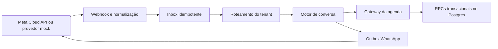

# ADR 0001 — Canal WhatsApp pela Cloud API oficial

- Status: aceito
- Data: 2026-07-31
- Decisores: equipe Agenda

## Contexto

Agenda precisa aceitar agendamentos pelo WhatsApp sem criar outro motor de agenda.
Vários estabelecimentos usarão primeiro um número central. O projeto ainda não possui
conta Meta, aplicativo, WABA, número registrado, credenciais ou webhook remoto.

O canal recebe conteúdo externo, processa eventos duplicados ou fora de ordem e lida
com dados pessoais. Slug e código de roteamento identificam contexto; nenhum deles
autoriza acesso. Postgres e RLS continuam responsáveis pelo isolamento entre tenants.

## Decisão

Usaremos somente WhatsApp Business Platform pela Cloud API oficial da Meta. O projeto
não usará WhatsApp Web, QR Code de sessão, automação de navegador, engenharia reversa
ou bibliotecas que simulem o aplicativo.

A integração será um módulo em `src/features/whatsapp` com estas fronteiras:

1. Provedor normaliza webhooks e envia mensagens abstratas.
2. Inbox persiste eventos externos antes do processamento.
3. Roteador resolve tenant pelo número receptor, código, sessão e histórico.
4. Máquina de estados conduz diálogo sem depender de React.
5. Gateway de agenda chama os casos de uso e RPCs existentes.
6. Outbox persiste respostas antes da entrega assíncrona.

O domínio produz texto, botões, listas, templates ou flows abstratos. O adaptador Meta
converte essas respostas para payloads externos. URLs, versões da Graph API e nomes de
campos da Meta não entram no domínio.

O primeiro estágio usa provedor mock. Ele deve atravessar as mesmas camadas de inbox,
roteamento, conversa, agenda e outbox. A interface marca a conexão real como pendente.
Produção continuará desativada até completar o checklist de ativação.

O número central pode atender vários tenants, e um tenant pode usar vários números.
Tokens de rota identificam o estabelecimento e não concedem permissão. Credenciais
futuras ficarão em cofre; o banco guardará apenas referência ao segredo.

## Segurança e autorização

- Webhook real valida corpo bruto e assinatura antes de aceitar o evento.
- Workers usam identidade interna, lease, tentativas limitadas e dead letter.
- Painel de tenant usa sessão, associação, papel e RLS.
- Painel global exige `app_metadata.platform_owner = true` validado no servidor.
- Administradores não recebem access token, app secret ou payload bruto irrestrito.
- Logs usam IDs técnicos e redação de conteúdo sensível.
- Simulador exige `platform_owner`, provedor mock e feature flag do servidor.

## Consequências

O site e WhatsApp disputam horários pela mesma transação e pela mesma constraint de
alocação. Duplicação de webhook não cria duas reservas. Novos números e Embedded
Signup podem entrar como adaptadores e vínculos de dados, sem reescrever conversa ou
agenda.

Inbox, outbox e estado persistido aumentam schema e operação. A equipe terá de manter
retenção, métricas, retries e limpeza de dados. O fluxo real depende de ativos e regras
externas que a Meta pode mudar.

## Alternativas rejeitadas

- WhatsApp Web ou sessão por QR: mecanismo não oficial e inadequado para SaaS.
- Inserir diretamente em `appointments`: duplica autorização e contorna concorrência.
- Processar toda conversa dentro do webhook: aumenta timeout e risco de reentrega.
- Guardar estado somente em memória: perde retomada e falha com múltiplos workers.
- Um número por tenant: impede número central e evolução para múltiplos números.

## Pendências antes da conexão real

- Escolher cofre e rotina de rotação de segredos.
- Confirmar versão vigente da Graph API, permissões e campos assinados.
- Criar conta Meta, aplicativo, WABA e registrar número.
- Aprovar templates, documentar opt-in e validar opt-out.
- Publicar HTTPS, configurar alertas e concluir teste controlado.

Detalhes operacionais: [Ativação da Meta](../whatsapp-meta-activation.md).
